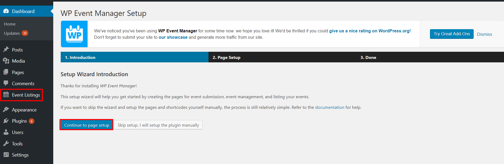

# 📅 Custom Event Management Plugin – WordPress

A simple and lightweight WordPress plugin that allows admins to create and manage events directly from the WordPress dashboard.
> Built for learning and showcasing WordPress plugin development 
## 🚀 Features
- Custom Post Type for Events
- Admin Menu Page: Manage Events
- Clean and minimal UI
- Custom CSS/JS integration
- Fully functional from WordPress Dashboard
---
## 📁 Folder Structure

event-management/
├── event-management.php
├── includes/
│ └── event-post-type.php
├── admin/
│ └── event-admin-page.php
├── css/
│ └── style.css
├── js/
│ └── script.js
└── readme.txt

---

## 💻 Tech Stack

- PHP
- WordPress Plugin API
- HTML, CSS, JavaScript

---

## 🛠️ Installation

1. Download the plugin or clone this repo.
2. Copy the `event-management` folder into your WordPress `/wp-content/plugins/` directory.
3. Go to WordPress Admin → Plugins → Activate **Custom Event Management** plugin.
4. A new **"Events"** menu will appear on the admin dashboard.

---

## 📸 Screenshots

_Add screenshots of the admin page and event listing (optional)_

📃 License
This project is licensed under the MIT License.

🙋‍♀️ Author
Prithi Babu
🔗 GitHub
🔗 LinkedIn
🎯 Aspiring WordPress Engineer | Open-source Contributor
yaml
Copy
Edit
---
### ✅ What To Do Now:

1. Go to your repo → Click `README.md` → ✏️ Edit  
2. Replace it with the above content  
3. Click **Commit changes**
---

### 🔁 Next: Make Your First PR Today?

Let’s continue by submitting your **first open-source pull request**.  
Want me to help you right now with the [LinkFree](https://github.com/EddieHubCommunity/LinkFree) PR?

✅ Reply with: `yes, help me with PR now`  
or  
✅ Tell me once your README is updated so I can check it.

Let’s finish Day 3 strong!
